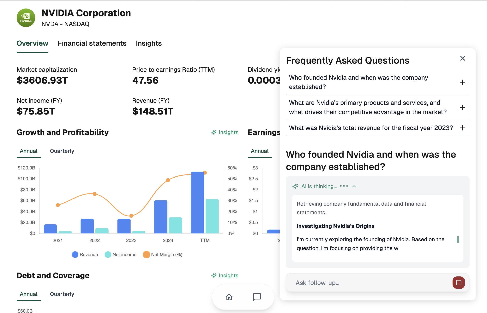

# Stonkie client

This is a [Next.js](https://nextjs.org) project that power Stonkie https://stonkie.vercel.app/. It's a modern, server-side rendered application using the latest web technologies.



## Tech Stack

This project is built with a modern and robust technology stack:

*   **Framework:** [Next.js 15](https://nextjs.org/) with [React 19](https://react.dev/) and [TypeScript](https://www.typescriptlang.org/). It utilizes the App Router for file-based routing and Server-Side Rendering (SSR).
*   **Styling:** [Tailwind CSS](https://tailwindcss.com/) for a utility-first CSS workflow.
*   **UI Components:**
    *   [Shadcn UI](https://ui.shadcn.com/): A collection of accessible and customizable components.
    *   [Radix UI](https://www.radix-ui.com/): For building high-quality, accessible design systems and web apps.
    *   [Lucide Icons](https://lucide.dev/): A beautiful and consistent icon set.
*   **Charting:** [Chart.js](https://www.chartjs.org/) with [react-chartjs-2](https://react-chartjs-2.js.org/) for data visualization.
*   **Data Fetching & State Management:** [TanStack React Query](https://tanstack.com/query/latest) for managing server state.
*   **Code Quality:**
    *   [ESLint](https://eslint.org/): For identifying and reporting on patterns in JavaScript.
    *   [Husky](https://typicode.github.io/husky/) & [lint-staged](https://github.com/okonet/lint-staged): For running linters on staged files before committing.

## Getting Started

To get the next.js development server running, follow these steps:

1.  **Install dependencies:**
    ```bash
    npm install
    ```

2.  **Run the development server:**
    ```bash
    npm run dev
    ```

Open [http://localhost:3000](http://localhost:3000) with your browser to see the result.

You can start editing the page by modifying `app/page.tsx`. The page auto-updates as you edit the file.

## Get the backend up and running
Since this is the front-end part of Stonkie, you'd need to run Stonkie backend running. Clone the repository https://github.com/vinhlee95/stonkie_backend and follow the instruction there.

## Development Guidelines

To maintain code quality and consistency, please adhere to the following guidelines when developing new features:

*   **Component-Based Architecture:** Build new UI elements as reusable React components and place them in the `app/components/` directory.
*   **Styling:** Use **Tailwind CSS** for all styling. Avoid inline styles or separate CSS files.
*   **Routing:** Create new routes by adding new folders and `page.tsx` files within the `app/` directory.
*   **Data Fetching:** Use **TanStack React Query** for all API interactions.
*   **Code Quality:** Run `npm run lint` to check for linting errors before committing your changes. The pre-commit hook will also run this command automatically.
*   **Icons:** Use icons from the **Lucide React** library.

## Learn More

To learn more about the technologies used in this project, refer to the following resources:

- [Next.js Documentation](https://nextjs.org/docs) - learn about Next.js features and API.
- [Learn Next.js](https://nextjs.org/learn) - an interactive Next.js tutorial.
- [Tailwind CSS Documentation](https://tailwindcss.com/docs) - learn about Tailwind CSS.
- [Shadcn UI Documentation](https://ui.shadcn.com/docs) - learn about Shadcn UI components.
- [TanStack React Query Documentation](https://tanstack.com/query/latest/docs/react/overview) - learn about TanStack React Query.

## Production deployment
All commits to `main` get deployed directly to production and will be live in https://stonkie.vercel.app/ within 1 minute or 2 🚢
